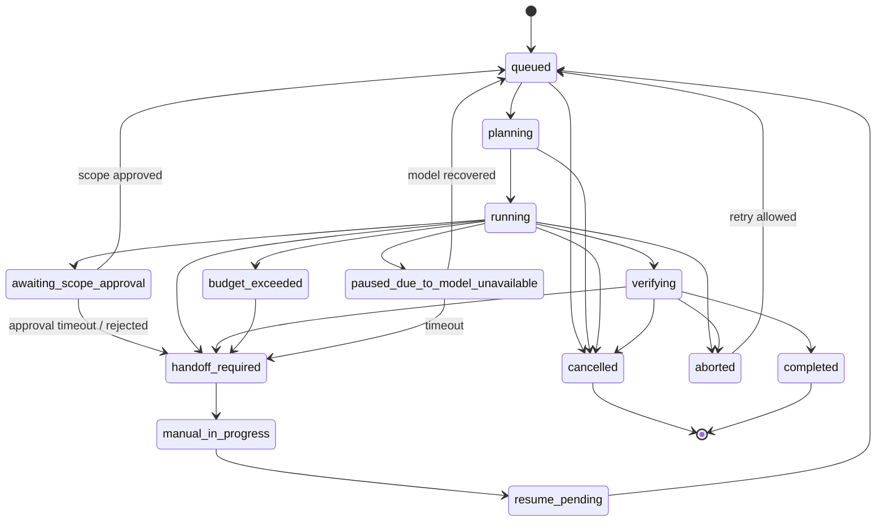

# DEVELOPMENT_SPEC_v1.3.2_FULL.md

# 基于 Multica 的 Dark Factory 开发文档

**版本**：v1.3.2 FULL  
**说明**：本文件为 `v1.3` 与 `v1.3.2 Patch` 的单文件合并终稿。  
如与更早版本存在冲突，以本文件为准。  
本终稿已合并以下边界修订：
- Checkout 工具化，禁止 Agent 自由切分支
- Handoff → Resume 的 Git 状态对齐与 `resume_base_commit` 自动抓取
- 人工无新提交时自动切换到 `resume_from_replan`
- `awaiting_scope_approval` 期间释放 Writer Lock
- `PREVIEW_SETUP_TIMEOUT` 归类为 `environment_error`
- 增加完整任务状态机图与合法状态流转规则
**定位**：在 Multica 现有任务板、runtime、daemon、自托管和多工作区骨架上，新增 Dark Factory 的控制平面、任务协议、执行隔离、自动验证闭环、失败回流、人工接管、恢复策略、预算与并发治理、命令沙箱、模型路由与可观测性。  
**状态**：本版本为当前唯一有效规范，覆盖并替代 v1.2 中冲突、缺失或模糊之处。  
**执行方式**：
- `hermes-agent`：代码实现、文件创建、局部重构、测试修复
- `GPT-5.4`：高层规划、关键审查、范围变更审批、最终拍板
- 其他模型按本文“模型分工与路由”章节分工

---

# 1. 项目目标

## 1.1 总目标

在 Multica 的现有能力基础上，增加一套最小可运行的 Dark Factory 闭环，实现：

1. 任务进入后自动生成 `task spec`
2. 自动生成 `acceptance spec`
3. 根据任务类型和风险等级完成模型路由
4. 在隔离环境中执行代码修改、测试、浏览器验收
5. 验证失败时自动生成结构化报告并回流
6. 多次失败或高风险命中时自动人工接管
7. 人工处理后按恢复策略重新交回 AI 或关闭任务
8. 在 Web 端查看 task spec、验收状态、artifact、handoff、重试历史、预算与执行轨迹

## 1.2 非目标

第一阶段明确不做：

- 不重写 Multica 的 board / issue / comment 主流程
- 不重写 daemon 核心协议
- 不重写 desktop 端
- 不做完整企业审批系统
- 不做生产自动发布
- 不从零重写平台
- 不暴露原始模型 CoT（只展示执行轨迹摘要）

---

# 2. 当前基础与约束

## 2.1 当前可复用能力

默认复用 Multica 当前已存在的这些能力：

- issue / comment / board / status 流程
- agent / runtime / workspace 管理
- 本地 daemon 执行骨架
- WebSocket 实时更新
- 自托管部署骨架
- `packages/core` / `packages/ui` / `packages/views` 分层

## 2.2 必须遵守的仓库约束

根据当前仓库的 `CLAUDE.md` 说明：

- `server/`：Go backend
- `apps/web/`：Next.js
- `apps/desktop/`：Electron
- `packages/core/`：无 UI 的 headless 业务逻辑
- `packages/ui/`：原子 UI 组件
- `packages/views/`：共享业务页面与组件
- 服务端状态必须由 TanStack Query 管理
- 客户端状态必须由 Zustand 管理
- WebSocket 只做 query invalidation，不直接写 store

这些边界必须保留。

---

# 3. 总体技术方案

## 3.1 核心原则

本项目采用 **“借壳做脑”** 方案：

- **壳**：Multica 的 board / issue / runtime / daemon / workspace / self-host
- **脑**：新增 Dark Factory control-plane
- **手**：模型路由 + coder / executor / reviewer / analyst
- **眼**：测试链 + Playwright + artifacts
- **刹车**：handoff policy + protected paths + risk policy + budget policy + circuit breaker

## 3.2 架构图

```text id="6a9x3l"
用户 / Issue / Webhook / 手工创建
        ↓
Multica issue / board / runtime / daemon
        ↓
Dark Factory Control Plane
  - task spec
  - acceptance spec
  - model routing
  - risk policy
  - handoff policy
  - budget & rate-limit policy
  - writer lock & scope change policy
        ↓
执行隔离层
  - git worktree
  - task container / preview container
  - cache mounts
  - resource limits
        ↓
执行层
  - GPT-5.4（主脑）
  - GLM-5.1（长时执行）
  - Qwen3-Coder（编码）
  - DeepSeek（根因分析/工具型分析）
  - Qwen3.6（长上下文/廉价跑量）
        ↓
验证层
  - lint / typecheck / unit / integration
  - Playwright E2E
  - screenshots / traces / reports
        ↓
结果回写
  - issue comments
  - run history
  - artifacts
  - handoff
  - verification state
```

---

# 4. 模型分工与路由

## 4.1 固定角色

- **Lead / 主脑 / 最终 Reviewer**：GPT-5.4
- **Long-run Executor / 长时执行器**：GLM-5.1
- **Coder / 常规编码**：Qwen3-Coder-Next
- **Coder+ / 高难编码**：Qwen3-Coder-Plus
- **Root Cause / 根因分析**：DeepSeek-Reasoner
- **Analyst / 工具型分析**：DeepSeek-Chat
- **Long Context Worker**：Qwen3.6-Plus
- **Bulk Worker**：Qwen3.6-Flash

## 4.2 职责

- **GPT-5.4**：任务拆解、验收标准、路线判断、范围审批、最终拍板
- **GLM-5.1**：长链路实现、连续修复、主执行线程
- **Qwen3-Coder**：代码实现与局部修补
- **DeepSeek-Reasoner**：失败复盘、复杂问题二审、根因分析
- **DeepSeek-Chat**：issue triage、日志分析、结构化中间结果
- **Qwen3.6-Plus**：长文档/长日志/长上下文整理
- **Qwen3.6-Flash**：摘要、分类、抽取、轻量跑量

## 4.3 模型降级与熔断

必须实现 `Circuit Breaker`：

- 当某模型连续失败、超时、5xx 或限流达到阈值时，将其标记为 `open`
- `open` 状态下新任务不再路由到该模型，转用 fallback
- 经过 `cooldown_window` 后进入 `half-open`
- `half-open` 成功后恢复到 `closed`

默认阈值：

- `consecutive_failures >= 5`
- `timeout_rate >= 50% within 5m`
- `429 burst >= 3 within 1m`

---

# 5. 执行隔离与预览环境

## 5.1 默认隔离模式

第一阶段默认采用 **单容器模式**：

- 每个 Task 创建一个独立 git worktree
- 每个 Task 创建一个独立容器
- Preview Server 与 Playwright 运行在同一容器中
- Playwright 访问 `http://127.0.0.1:<preview_port>`

原因：避免 MVP 阶段复杂的跨容器网络发现。

## 5.2 双容器模式（预留）

如果后续需要分离 Preview 与 Playwright：

- 每个 Task 创建独立 docker network：`df_task_<task_id>`
- Preview 容器 service name 固定为 `preview`
- Playwright 容器只能访问 `http://preview:<port>`
- network、preview、playwright 三者必须统一生命周期管理

## 5.3 Preview 启动流程

```text id="c40kfo"
1. 创建 task worktree
2. 创建 task container
3. 安装依赖 / 恢复缓存
4. 启动 preview server
5. 轮询健康检查 URL
6. 健康检查通过后再执行 Playwright
7. 收集 trace / screenshot / HTML report
8. 停止 preview server
9. 销毁容器
10. 清理 worktree
```

## 5.4 健康检查

必须定义：

- `preview_port`
- `healthcheck_url`
- `healthcheck_interval_ms`
- `healthcheck_timeout_ms`
- `max_preview_boot_seconds`

默认规则：
- 30 秒内未启动成功：判定为 `preview_boot_failed`
- 已启动但健康检查失败：判定为 `preview_unhealthy`

## 5.5 Playwright 运行时容错

Playwright 运行过程中必须处理：

- 页面崩溃
- 浏览器 crash
- 弹窗阻塞
- selector timeout
- navigation timeout
- 资源加载失败

每类异常都必须映射到统一错误码，例如：
- `PW_PAGE_CRASH`
- `PW_DIALOG_BLOCKED`
- `PW_SELECTOR_TIMEOUT`
- `PW_NAV_TIMEOUT`

并生成结构化 `verification result`。

## 5.6 容器资源硬限制

每个 Task 容器必须显式设置：

- `--cpus`
- `--memory`
- `--pids-limit`
- `ulimit`
- 默认非 root 用户
- 默认只挂载 task worktree、共享缓存与 artifact 目录

推荐默认值：

```yaml id="jlwmgf"
container_limits:
  cpus: "2"
  memory: "4g"
  pids_limit: 512
  nofile: 4096
```

---

# 6. Git、Worktree 与并发写保护

## 6.1 Git 工作流规范

- 每个 Task 强制独立分支：`task/<task_id>`
- 每个 Task 强制独立 worktree
- 同一 Task 同一时刻只允许一个 writer
- 所有自动修改先落在 task branch
- 验证通过后生成 PR
- 默认采用 `Squash Merge`

## 6.2 Writer Lock 规则

针对同一 `writer_lock_key`：

- 只允许一个写者进入
- 其他任务排队
- lock 必须支持 TTL
- lock 必须支持心跳续租
- lock 必须支持 orphan recovery

推荐字段：

```yaml id="7ythde"
writer_lock:
  key: workspace:path-scope
  ttl_seconds: 300
  heartbeat_seconds: 30
  max_lease_seconds: 1800
```

## 6.3 锁失效与死锁防护

必须实现：

- TTL 到期自动释放
- 任务进程死亡后自动释放
- 定时扫描孤儿锁
- 记录 `lock_owner_task_id`
- 锁争抢失败时进入队列，不允许 busy loop

## 6.4 Worktree 生命周期

必须实现 `sandbox/worktree-manager.ts`，负责：

- create worktree
- mark active
- cleanup worktree
- prune stale worktrees
- recover orphaned worktrees

## 6.5 强制清理钩子

无论成功、失败、handoff、timeout，都必须执行：

```text id="8q0bx5"
try:
  create worktree
  run task
finally:
  stop preview
  collect artifacts
  remove temp files
  remove worktree
  git worktree prune
```

并额外有定时清理器处理：
- 进程被 kill
- daemon 崩溃
- 机器重启

---

# 7. 目录结构

## 7.1 新增目录

```text id="grn3b2"
control-plane/
task-templates/
policies/
runtime/
docs/darkfactory/
```

## 7.2 重点改造目录

```text id="u81tpx"
server/
packages/core/
packages/views/
packages/ui/
apps/web/
e2e/
```

## 7.3 目标目录骨架

```text id="2ekr84"
multica-factory/
├─ apps/
│  ├─ web/
│  └─ desktop/
├─ server/
├─ packages/
│  ├─ core/
│  ├─ ui/
│  └─ views/
├─ e2e/
├─ docs/
│  └─ darkfactory/
├─ control-plane/
├─ task-templates/
├─ policies/
├─ runtime/
└─ scripts/
```

---

# 8. 文件级开发清单

## 8.1 顶层新增

### `control-plane/`

```text id="f0h62m"
control-plane/
├─ package.json
├─ README.md
├─ src/
│  ├─ index.ts
│  ├─ config.ts
│  ├─ intake/
│  │  ├─ issue-ingest.ts
│  │  ├─ webhook-ingest.ts
│  │  └─ manual-ingest.ts
│  ├─ schemas/
│  │  ├─ task.schema.json
│  │  ├─ acceptance.schema.json
│  │  ├─ artifact.schema.json
│  │  └─ event.schema.json
│  ├─ planners/
│  │  ├─ build-task-spec.ts
│  │  ├─ build-acceptance-spec.ts
│  │  └─ infer-scope.ts
│  ├─ policies/
│  │  ├─ assignment-policy.ts
│  │  ├─ handoff-policy.ts
│  │  ├─ risk-policy.ts
│  │  ├─ command-policy.ts
│  │  ├─ path-policy.ts
│  │  └─ concurrency-policy.ts
│  ├─ workflows/
│  │  ├─ feature-flow.ts
│  │  ├─ bugfix-flow.ts
│  │  ├─ refactor-flow.ts
│  │  └─ research-flow.ts
│  ├─ adapters/
│  │  ├─ multica-api.ts
│  │  ├─ github.ts
│  │  ├─ playwright.ts
│  │  └─ artifact-store.ts
│  ├─ llm/
│  │  ├─ client.ts
│  │  ├─ budget-interceptor.ts
│  │  ├─ circuit-breaker.ts
│  │  └─ context-serializer.ts
│  ├─ scheduler/
│  │  ├─ project-lead-scan.ts
│  │  ├─ retry-queue.ts
│  │  └─ rate-limit-queue.ts
│  └─ sandbox/
│     ├─ worktree-manager.ts
│     ├─ container-manager.ts
│     ├─ preview-manager.ts
│     └─ cache-manager.ts
└─ config/
   └─ model-routing.yaml
```

### `task-templates/`
- `feature.task.yaml`
- `bugfix.task.yaml`
- `refactor.task.yaml`
- `research.task.yaml`
- `release.task.yaml`

### `policies/`
- `protected-paths.yaml`
- `allowed-commands.yaml`
- `handoff-rules.yaml`
- `severity-matrix.yaml`
- `workspace-policy.yaml`
- `resource-limits.yaml`
- `cache-policy.yaml`

### `runtime/`
- `artifacts/`
- `reports/`
- `screenshots/`
- `traces/`
- `task-runs/`

### `docs/darkfactory/`
- `architecture.md`
- `task-spec.md`
- `acceptance-spec.md`
- `runtime-policy.md`
- `handoff-rules.md`
- `verification-pipeline.md`
- `rollout-plan.md`
- `er-model.md`
- `context-passing.md`

## 8.2 修改现有文件

### 根目录
- `CLAUDE.md`
- `AGENTS.md`
- `package.json`
- `docker-compose.selfhost.yml`
- 可选：`playwright.config.ts`

### server
新增：
- `server/internal/darkfactory/taskspec/*`
- `server/internal/darkfactory/acceptance/*`
- `server/internal/darkfactory/artifacts/*`
- `server/internal/darkfactory/verification/*`
- `server/internal/darkfactory/handoff/*`
- `server/internal/darkfactory/projectlead/*`
- `server/internal/darkfactory/budget/*`
- `server/internal/darkfactory/locks/*`

新增 API：
- `server/internal/api/taskspec_handlers.go`
- `server/internal/api/acceptance_handlers.go`
- `server/internal/api/artifact_handlers.go`
- `server/internal/api/verification_handlers.go`
- `server/internal/api/handoff_handlers.go`
- `server/internal/api/budget_handlers.go`
- `server/internal/api/lock_handlers.go`

新增事件：
- `server/internal/realtime/darkfactory_events.go`

新增迁移：
- `server/migrations/*darkfactory*.sql`

新增 sqlc queries：
- `server/pkg/db/queries/darkfactory_*.sql`

### packages/core
新增：

```text id="pf8nyx"
packages/core/src/darkfactory/
├─ models/
├─ api/
├─ queries/
├─ stores/
└─ ws/
```

### packages/views
新增：

```text id="o7n358"
packages/views/src/darkfactory/
├─ pages/
├─ sections/
└─ components/
```

### packages/ui
新增：

```text id="qu4sd9"
packages/ui/src/darkfactory/
├─ badges/
├─ cards/
├─ timeline/
└─ log-viewer/
```

### apps/web
新增 route：
- `apps/web/app/factory/page.tsx`
- `apps/web/app/factory/issues/[id]/page.tsx`
- `apps/web/app/factory/projects/[id]/page.tsx`
- `apps/web/app/factory/runtimes/page.tsx`

### e2e
第一阶段只要求以下 3 条：
- `e2e/darkfactory/task-spec-flow.spec.ts`
- `e2e/darkfactory/verification-flow.spec.ts`
- `e2e/darkfactory/handoff-flow.spec.ts`

第二阶段再增加：
- `e2e/darkfactory/project-lead-flow.spec.ts`
- `e2e/darkfactory/resume-flow.spec.ts`

---

# 9. 数据协议

## 9.1 Task Spec（权威版）

> 本节覆盖此前所有冲突字段。若其他章节与此节不一致，以此节为准。

```yaml id="tvp4pz"
task_id: DF-2026-000001
task_type: feature
title: Add invite member flow
goal: Allow workspace admins to invite members by email
scope:
  include:
    - apps/web/src/**
    - server/internal/**
    - packages/core/**
  exclude:
    - infra/**
    - migrations/**
risk_level: medium
acceptance_required: true
allowed_tools:
  - read
  - grep
  - edit
  - write
  - bash
  - playwright
forbidden_paths:
  - .env
  - migrations/**
writer_lock_key: workspace:invite-flow
base_commit: abcdef123456
merge_strategy: squash
budget_limit_usd: 8.00
max_tokens_per_run: 200000
max_reasoner_calls: 3
max_lead_calls: 5
priority: normal
resumption_policy: resume_from_failed_gate
handoff_rules:
  - retry_count_gte_4
  - protected_path_touched
  - security_or_payment_logic_changed
deliverables:
  - pull_request
  - verification_report
  - rollback_notes
```

## 9.2 Acceptance Spec

```yaml id="up11bd"
task_id: DF-2026-000001
criteria:
  - Admin can open invite dialog
  - Admin can send invite by email
  - Duplicate pending invite is handled
  - Invite status is visible in UI
  - Unit tests added
  - Playwright invite flow passes
verification:
  - typecheck
  - unit
  - playwright
```

## 9.3 Artifact Meta

```json id="a7xvh0"
{
  "task_id": "DF-2026-000001",
  "run_id": "RUN-001",
  "type": "playwright-trace",
  "path": "runtime/traces/RUN-001.zip",
  "created_at": "2026-04-19T12:00:00Z"
}
```

## 9.4 Verification Result

```json id="rqjlwm"
{
  "task_id": "DF-2026-000001",
  "run_id": "RUN-001",
  "gate": "playwright",
  "status": "failed",
  "error_code": "PW_SELECTOR_TIMEOUT",
  "summary": "Invite submit button disabled after email input",
  "evidence": {
    "trace": "runtime/traces/RUN-001.zip",
    "screenshot": "runtime/screenshots/RUN-001-step-4.png",
    "stderr": "button remains disabled"
  },
  "next_hint": "check form validation and disabled condition"
}
```

## 9.5 Handoff Event

```json id="k6x8fw"
{
  "task_id": "DF-2026-000001",
  "reason": "protected_path_touched",
  "retry_count": 3,
  "final_decider": "gpt-5.4",
  "status": "handoff_required"
}
```

## 9.6 Resume Event

```json id="eokco3"
{
  "task_id": "DF-2026-000001",
  "resume_mode": "resume_from_failed_gate",
  "manual_resolution": "invite validation fixed by human",
  "approved_by": "human-reviewer-001",
  "status": "resume_pending"
}
```

---

# 10. 数据模型与 ER 关系

必须补充核心实体关系，供 Go + sqlc 开发使用。

## 10.1 核心实体

- `factory_task_specs`
- `factory_acceptance_specs`
- `factory_runs`
- `factory_verification_results`
- `factory_artifacts`
- `factory_handoffs`
- `factory_resume_events`
- `factory_budgets`
- `factory_writer_locks`
- `factory_scope_change_requests`

## 10.2 基本关系

```text id="l3k8gm"
issue 1 --- 1 task_spec
issue 1 --- 1 acceptance_spec
issue 1 --- N runs
run   1 --- N verification_results
run   1 --- N artifacts
issue 1 --- N handoffs
issue 1 --- N resume_events
issue 1 --- 1 budget_state
writer_lock_key 1 --- 1 active_lock
issue 1 --- N scope_change_requests
```

## 10.3 最低字段要求

### `factory_writer_locks`
- `lock_key`
- `task_id`
- `owner_id`
- `lease_expires_at`
- `heartbeat_at`
- `status`

### `factory_budgets`
- `task_id`
- `budget_limit_usd`
- `budget_used_usd`
- `soft_limit_triggered`
- `hard_limit_triggered`

### `factory_scope_change_requests`
- `task_id`
- `requested_by`
- `old_scope`
- `new_scope`
- `reason`
- `status`
- `approved_by`

---

# 11. API 设计

## 11.1 Task Spec
- `GET /factory/issues/:id/task-spec`
- `PUT /factory/issues/:id/task-spec`

## 11.2 Acceptance
- `GET /factory/issues/:id/acceptance`
- `PUT /factory/issues/:id/acceptance`

## 11.3 Verification
- `POST /factory/runs/:id/verification`
- `GET /factory/runs/:id/verification`
- `GET /factory/issues/:id/verification-history`

## 11.4 Artifacts
- `POST /factory/runs/:id/artifacts`
- `GET /factory/issues/:id/artifacts`

## 11.5 Handoff
- `POST /factory/issues/:id/handoff`
- `GET /factory/issues/:id/handoff`

## 11.6 Resume
- `POST /factory/issues/:id/resume`
- `GET /factory/issues/:id/resume-history`

## 11.7 Project Lead
- `POST /factory/projects/:id/scan`
- `GET /factory/projects/:id/lead-status`

## 11.8 Scope Change
- `POST /factory/issues/:id/scope-change`
- `GET /factory/issues/:id/scope-change-history`
- `POST /factory/issues/:id/scope-change/:change_id/approve`
- `POST /factory/issues/:id/scope-change/:change_id/reject`

---

# 12. WebSocket 事件

新增事件类型：

- `factory:taskspec.updated`
- `factory:acceptance.updated`
- `factory:verification.updated`
- `factory:artifact.added`
- `factory:handoff.created`
- `factory:resume.created`
- `factory:projectlead.updated`
- `factory:budget.updated`
- `factory:scope_change.updated`

规则：
- 事件只触发 query invalidation
- 不直接写 Zustand
- 服务端状态继续走 TanStack Query

---

# 13. 前端页面与人工介入介质

## 13.1 Factory Dashboard
展示：
- 任务总数
- 进行中任务
- 自动通过率
- handoff 数量
- 最近失败任务
- runtime 健康状态
- 当前预算使用率

## 13.2 Issue 详情页
新增 Dark Factory 面板：
- Task Spec
- Acceptance
- Verification
- Artifacts
- Handoff
- Retry Timeline
- Execution Trace 摘要
- Resume History
- Scope Change Requests

## 13.3 Project Lead 页面
展示：
- 项目扫描结果
- 阻塞 issue
- 重试过多 issue
- 无人领取 issue
- 建议 follow-up

## 13.4 Runtime Policy 页面
展示：
- 当前 runtime
- 允许模型
- protected paths
- allowed commands
- policy 版本
- queue 状态
- circuit breaker 状态

## 13.5 人工接管介质

第一阶段明确采用以下介质：

- Web 端 Issue 详情页中的 `Handoff Panel`
- 人工通过 UI 提交：
  - comment
  - resolution summary
  - whether to resume
  - resume mode

第一阶段 **不要求** Web IDE。人工修复可通过本地 clone / 本地 IDE 完成，然后推送到 task branch，再由 UI 触发 resume。

---

# 14. Control Plane 逻辑

## 14.1 Intake 流程

输入来源：
- Multica issue 创建
- Webhook
- 手工触发

处理步骤：
1. 读取 issue 内容
2. 判断任务类型
3. 生成 `task spec`
4. 生成 `acceptance spec`
5. 计算风险等级
6. 选择模型与角色
7. 分配 writer lock
8. 启动对应 workflow

## 14.2 Assignment Policy

- feature 低风险：`gpt-5.4 + glm-5.1 + qwen3-coder-next`
- feature 高风险：`gpt-5.4 + glm-5.1 + qwen3-coder-plus + deepseek-reasoner`
- bugfix 多次失败：增加 `deepseek-reasoner`
- research：`qwen3.6-plus + gpt-5.4`
- triage：`qwen3.6-flash + deepseek-chat`

## 14.3 Handoff Policy

满足任一条件则转人工：
- retry >= 4
- touched protected path
- scope expanded beyond task
- changed security/payment logic
- reviewer 判定 rollback 风险过高
- hard budget limit 触发且无法安全降级

## 14.4 Resumption Policy

恢复模式仅允许三种：

- `resume_from_failed_gate`
- `resume_from_replan`
- `manual_close`

规则：
- 人工修复未改变验收标准：`resume_from_failed_gate`
- 人工修复改变范围或目标：`resume_from_replan`
- 人工处理后任务已完成或不再交回 AI：`manual_close`

## 14.5 Scope Change Policy

当 Agent 发现原任务不可行或范围必须调整时：

1. 创建 `scope_change_request`
2. 由 GPT-5.4 输出变更理由与新范围建议
3. 人工批准或拒绝
4. 批准后重新生成 task spec / acceptance spec
5. 未批准不得继续扩范围写入

## 14.6 Project Lead Scheduler

周期扫描：
- 超时未推进 issue
- 重试多次 issue
- 测试失败未处理 issue
- 已阻塞 issue
- writer lock 异常 issue
- 预算耗尽 issue

处理动作：
- 更新 lead-status
- 创建 follow-up
- 发提醒 comment
- 必要时触发 handoff

---

# 15. 上下文传递与窗口控制

## 15.1 多模型接力原则

不同模型接力时，不直接全量复制上下文，而是统一经过 `context-serializer.ts`：

- 任务摘要
- 当前阶段
- 相关代码路径
- 最近 diff 摘要
- 最近失败摘要
- 下一步目标

## 15.2 Context Window 超限策略

当上下文过大时，按顺序处理：

1. 保留 task spec / acceptance spec
2. 保留最近一次失败摘要
3. 保留最近 diff 摘要
4. 对旧日志与旧评论做分块摘要
5. 必要时从 artifact store / RAG 索引按需取回

## 15.3 RAG / 摘要策略

第一阶段最小实现：
- 只做摘要，不做复杂向量检索

第二阶段：
- 对 issue comments / verification logs / artifacts 建向量索引
- 支持按 task_id、path、error_code 检索

---

# 16. 预算、限流与优雅中断

## 16.1 预算字段

每个 Task 必须显式定义：

- `budget_limit_usd`
- `max_tokens_per_run`
- `max_reasoner_calls`
- `max_lead_calls`
- `priority`

## 16.2 实时预算拦截器

必须实现：
- `control-plane/src/llm/client.ts`
- `control-plane/src/llm/budget-interceptor.ts`

职责：
1. 调用前预算预检查
2. 流式过程中累计 token 和成本
3. 接近阈值时触发 soft limit
4. 超阈值时执行 hard limit
5. 调用后记账

## 16.3 软阈值与硬阈值

- `soft_limit = 80%`
- `hard_limit = 100%`

### soft limit 动作
- 禁止升级到高成本模型
- 禁止开启新的 reasoning 深模式
- 标记 `budget_warning`

### hard limit 动作
- 停止创建新的模型调用
- 当前流式输出不做粗暴截断写文件
- 若当前输出尚未提交到文件，则直接终止
- 若当前输出已进入临时文件，则允许当前原子写操作完成
- 完成后立即停止后续步骤
- 回滚到最近 checkpoint 或丢弃临时输出
- 任务进入 `budget_exceeded`

## 16.4 优雅中断规则

严禁在文件半写入状态下硬停。必须使用：

- 临时文件写入
- checksum/size 校验
- 原子 rename 提交
- checkpoint 回退

## 16.5 速率限制与并发池

必须实现：
- `control-plane/src/scheduler/rate-limit-queue.ts`
- `control-plane/src/policies/concurrency-policy.ts`

按模型维度维护：
- RPM
- TPM
- 并发上限
- 优先级队列

高优先级可抢占低优先级排队，不允许无限等待。

---

# 17. 验证闭环

## 17.1 必跑关卡
- format
- lint
- typecheck
- unit
- integration（按任务需要）
- Playwright E2E（UI 变更任务必跑）

## 17.2 失败处理

失败时必须生成：
- `verification result`
- stderr
- git diff
- screenshot
- trace
- next_hint
- error_code

## 17.3 回流链

固定升级链：

1. `Qwen3.6-Flash` 整理失败日志
2. `Qwen3-Coder-Next` 再修
3. `DeepSeek-Reasoner` 做根因分析
4. `GLM-5.1` 继续执行修复
5. `GPT-5.4` 决定继续还是 handoff

---

# 18. 安全、命令沙箱与缓存策略

## 18.1 Protected Paths
默认禁止：
- `.env`
- `migrations/**`
- `infra/**`
- `scripts/prod/**`

## 18.2 Allowed Commands
允许：
- `pnpm *`
- `go test *`
- `go build *`
- `git status`
- `git diff`
- `playwright test *`

默认禁止：
- `curl *`
- `wget *`
- `nc *`
- `rm -rf *`
- 任意生产环境发布命令
- 任意 secrets 读取命令

## 18.3 Shell 静态检查

必须对 shell 命令做静态扫描，拦截：
- 网络请求
- 读取敏感文件
- 删除危险路径
- 后台常驻可疑命令

## 18.4 依赖安装策略

Node 依赖默认：
- `pnpm install --ignore-scripts`

只有在明确定义受信范围时，才允许特殊脚本执行。

## 18.5 缓存分层策略

### 预热镜像
负责：
- 冷启动基础依赖
- Playwright browsers
- Go toolchain
- 常见系统库

### 共享缓存
负责：
- 运行时增量缓存
- pnpm store
- go build cache
- playwright cache

### 任务私有层
负责：
- worktree
- node_modules（可选）
- build outputs
- artifacts

> 规则：预热镜像解决“基础”，共享缓存解决“增量”，两者职责不同，不得混淆。

## 18.6 共享缓存并发写安全

共享缓存默认采用：
- 多读单写
- 受控写入
- 写入锁

具体规则：
- pnpm store 默认只读挂载
- 若必须写入，交由 `cache-manager.ts` 串行执行
- 不允许多个 task 同时写共享 store

## 18.7 缓存损坏检测

以下情况视为缓存损坏：
- hash 校验失败
- 依赖文件缺失
- 权限错误
- install 阶段出现 store corruption 明确信号

处理策略：
1. 当前 task 回退到无缓存安装
2. 标记共享缓存为 `suspect`
3. 由后台任务清理并重建受影响缓存范围
4. 不立即清空所有全局缓存，除非验证为系统级损坏

## 18.8 人工接管

必须保留人工 gate：
- 最终高风险发布
- 涉及支付/安全/权限系统
- 核心路径大范围重构
- 触碰受保护目录

---

# 19. 可观测性

## 19.1 Execution Trace 摘要

只展示可解释轨迹，不展示原始 CoT。

展示内容：
- 当前阶段
- 最近一步动作
- 最近一次工具调用
- 当前假设摘要
- 当前 blocker
- 当前重试次数
- 当前预算使用率

## 19.2 建议 UI 组件

- 执行进度条
- 当前阶段标签
- 最近一步动作流
- 失败原因摘要卡片
- 下一步计划卡片

---

# 20. 修改说明

## 20.1 `CLAUDE.md`
追加章节：
- `## Dark Factory Rules`
- `## Task Spec Contract`
- `## Acceptance and Verification`
- `## Handoff Conditions`
- `## Artifact Requirements`
- `## Execution Isolation`
- `## Writer Lock and Cleanup`

## 20.2 `package.json`
新增脚本：
- `df:control`
- `df:build`
- `df:seed`
- `df:e2e`
- `df:verify`

## 20.3 `docker-compose.selfhost.yml`
新增：
- `control-plane` service
- `runtime_artifacts` volume
- `shared_pnpm_store` volume
- `shared_go_build_cache` volume

---

# 21. 开发顺序

## 第一周（P0）
目标：跑通隔离骨架与最小闭环

1. Fork 并跑通 Multica
2. 新建 `control-plane/`
3. 新建 `task-templates/`
4. 新建 `policies/`
5. 实现 `worktree-manager.ts`
6. 实现 `container-manager.ts`
7. 实现 `preview-manager.ts`
8. 后端增加 task-spec API
9. 前端显示 Task Spec Panel
10. 写第一条 E2E：issue → task spec 可见

## 第二周（P1）
目标：打通验证与预算治理

1. 增加 verification API
2. 增加 artifact API
3. 实现 `budget-interceptor.ts`
4. 增加 Verification Panel
5. 接入 Playwright 报告
6. 写第二条 E2E：verification 失败展示

## 第三周（P1）
目标：打通 handoff / resume / lock

1. 增加 handoff API
2. 增加 resume API
3. 增加 writer lock TTL 与恢复
4. 前端增加 Handoff Panel 与 Resume History
5. 写第三条 E2E：命中规则后人工接管与恢复

## 第四周（P2）
目标：Project Lead 与模型路由

1. 增加 project-lead scheduler
2. 增加 Project Lead 页面
3. 接入 model-routing.yaml
4. 增加 circuit breaker
5. 写第四条 E2E：scan 后生成 follow-up / lead 状态

---

# 22. DoD（完成定义）

以下全部满足才算第一阶段完成：

1. 可以在 self-host 环境正常运行
2. issue 创建后自动生成 task spec
3. issue 详情页可看到 task spec / acceptance
4. 至少一条 feature-flow 能跑到 verification
5. verification 失败会生成 artifacts 和 structured report
6. handoff 规则生效
7. resume 规则生效
8. writer lock TTL 生效
9. 预算软硬阈值生效
10. 3 条第一阶段 E2E 全通过

> 说明：project-lead 与更多 E2E 归入第二阶段，不作为第一阶段 DoD。

---

# 23. 直接给 Agent 的执行指令

```md id="jct8te"
你正在一个 Multica fork 上开发 Dark Factory 功能。请遵守以下规则：

1. 不要重写现有 board、issue、comment、daemon 主体逻辑。
2. 基于现有 monorepo 分层开发：
   - server/ 放后端
   - packages/core/ 放 headless 逻辑
   - packages/views/ 放共享业务页面
   - packages/ui/ 放原子组件
   - apps/web/ 只做 route 挂载
3. 先创建以下新增目录：
   - control-plane/
   - task-templates/
   - policies/
   - runtime/
   - docs/darkfactory/
4. 第一阶段必须完成：
   - task spec API
   - acceptance API
   - verification API
   - artifact API
   - handoff API
   - resume API
   - writer lock TTL
   - budget interceptor
   - issue 详情页的 Task Spec / Verification / Handoff / Resume 面板
   - 3 条 e2e
5. 模型路由按以下角色：
   - GPT-5.4：Lead / Reviewer
   - GLM-5.1：Executor
   - Qwen3-Coder-Next：Coder
   - Qwen3-Coder-Plus：High-risk Coder
   - DeepSeek-Reasoner：Root Cause
   - DeepSeek-Chat：Analyst
   - Qwen3.6-Plus：Long Context Worker
   - Qwen3.6-Flash：Bulk Worker
6. 任何服务端状态必须走 Query，不允许复制到 Zustand。
7. WebSocket 事件只做 invalidation，不允许直接写 store。
8. 所有 task 必须在独立 worktree + 容器中执行。
9. 所有容器必须带 CPU / 内存限制。
10. 每完成一个大步骤，输出：
   - 已创建/修改文件清单
   - 当前未完成项
   - 本地验证结果
11. 先完成最小闭环，再做 project-lead。
```

---

# 24. 执行建议

先让 agent 按这个顺序执行：

**跑通 Multica → 新增 control-plane → 打通 task spec → 打通 preview + verification → 打通 budget/interceptor → 打通 handoff/resume/lock → 最后做 project-lead。**


---

# 附录 A：v1.3.2 合并修订（已纳入正式规范）

以下内容为 v1.3.2 的边界修订说明，保留在终稿中作为实现时的明确约束。若与正文任一段落存在冲突，以本附录及本文件版本说明为准。

# DEVELOPMENT_SPEC_v1.3.2_PATCH.md

**用途**：本补丁是对 `DEVELOPMENT_SPEC_v1.3` / `v1.3.1` 的最小边界修订版。  
**目标**：不改主架构，只补足 5 个会显著影响实现正确性的边界条件，并增加 1 张任务状态机图。  
**适用方式**：将本补丁与 `DEVELOPMENT_SPEC_v1.3.md` 一并提供给 hermes-agent 与 GPT-5.4；若存在冲突，以本补丁为准。

---

# 1. 本补丁修订项

本补丁仅覆盖以下 6 项：

1. `git checkout <task-branch>` 工具化，禁止 Agent 自由拼接分支名  
2. Handoff 后人工无新提交时的 Resume 死循环处理  
3. `resume_base_commit` 由后端自动抓取，不由前端/人工填写  
4. `awaiting_scope_approval` 期间释放 Writer Lock  
5. `PREVIEW_SETUP_TIMEOUT` 归类为 `environment_error`，不进入代码回流链  
6. 增加完整任务状态机图与合法状态转移规则  

---

# 2. Git 分支与 Checkout 工具化

## 2.1 禁止通用 checkout 命令

从本补丁开始，Agent **不得直接执行**：

- `git checkout <dynamic-branch>`
- `git switch <dynamic-branch>`

原因：即使白名单限制了 `git checkout <task-branch>`，只要 `<task-branch>` 由 Agent 动态拼接，仍存在切到 `main`、其他 task 分支或任意非法 ref 的风险。

## 2.2 必须改为内部工具方法

执行层必须提供受控工具方法：

- `checkoutTaskBranch(taskId)`
- `createTaskWorktree(taskId, baseCommit)`
- `recreateTaskWorktree(taskId, baseCommit)`

这些方法由 `worktree-manager.ts` 或等价模块实现，内部强制遵守：

- 任务分支命名必须为：`task/<task_id>`
- 不允许 checkout 到 `main`、`master`、`develop` 或任意非任务分支
- 不允许接受原始自由字符串作为分支目标

## 2.3 任务分支规范

统一命名：

```text
 task/<task_id>
```

示例：

```text
 task/DF-2026-000123
```

---

# 3. Handoff → Resume 的 Git 状态对齐

## 3.1 Resume 必须基于远端最新提交

Resume 时，执行层不得基于本地旧 worktree 或旧 commit 继续运行。  
Resume 的唯一合法基准是：

- 远端 `task/<task_id>` 分支的最新 HEAD commit

## 3.2 新字段：handoff_commit / resume_base_commit

补充定义：

- `handoff_commit`：进入 Handoff 时，任务分支的远端提交 hash
- `resume_base_commit`：恢复执行时，远端任务分支当前最新提交 hash

## 3.3 `resume_base_commit` 的填充方式

`resume_base_commit` **不得由前端或人工填写**。  
后端在收到 Resume 请求后，必须自动执行：

1. `git fetch origin task/<task_id>`
2. 读取远端 HEAD
3. 将其写入 `resume_base_commit`

前端只触发 Resume 动作，不感知 commit hash。

## 3.4 人工无新提交时的处理

如果检测到：

- `resume_base_commit == handoff_commit`
- 且当前 `resume_mode == resume_from_failed_gate`

则系统不得直接恢复原失败关卡。必须二选一：

### 默认规则
改为：

```text
resume_from_replan
```

也就是重新规划，而不是在同一代码状态上重试。

### 可选 UI 提示
前端可以提示：

```text
未检测到人工新提交。本次恢复将进入重新规划模式；如需继续原流程，请先提交修复代码或补充更明确指导。
```

## 3.5 Resume 重建步骤

Resume 执行标准流程：

1. 后端抓取 `resume_base_commit`
2. 创建新 worktree
3. checkout `task/<task_id>`
4. hard reset 到 `resume_base_commit`
5. 重建容器
6. 根据 `resume_mode` 继续执行

---

# 4. Scope 审批期间的 Writer Lock 规则

## 4.1 新状态

当 Agent 发起范围变更申请时，任务主状态进入：

```text
awaiting_scope_approval
```

## 4.2 进入该状态时必须释放 Writer Lock

一旦进入 `awaiting_scope_approval`，系统必须：

1. 停止当前写入动作
2. 释放 Writer Lock
3. 保留任务元数据与范围变更请求记录
4. 允许其他不冲突任务继续调度

原因：Scope 审批可能持续数分钟到数小时，继续持有锁会造成不必要阻塞。

## 4.3 审批通过后的恢复规则

审批通过后，任务状态不得直接回到 `running`，而应转为：

```text
queued
```

之后重新进入标准调度流程：

1. 重新排队
2. 重新申请 Writer Lock
3. 重新创建或恢复 worktree
4. 继续执行

## 4.4 审批超时

新增字段：

- `scope_change_request.expires_at`

如果超时仍未审批，则默认：

```text
handoff_required
```

## 4.5 建议增加字段

建议增加：

- `max_scope_changes`

默认值建议：

```text
2
```

超过次数后，直接转人工，不再允许继续范围扩张。

---

# 5. Preview Setup Timeout 的错误分类

## 5.1 新错误分类

新增错误类型：

```text
environment_error
```

## 5.2 PREVIEW_SETUP_TIMEOUT 的归类

以下错误默认归类为 `environment_error`，而不是代码错误：

- `PREVIEW_SETUP_TIMEOUT`
- 依赖安装失败
- PNPM Store 损坏
- 预热镜像缺失依赖
- 缓存权限错误
- 预览启动前的环境准备失败

## 5.3 处理策略

当出现 `environment_error` 时：

### 允许动作
- 使用无缓存模式重试一次
- 切换到备用预热镜像
- 切换到干净 PNPM Store
- 转人工排查环境

### 禁止动作
- 不进入普通代码修复回流链
- 不要求 coder/reasoner 通过修改业务代码来“修复”环境问题

## 5.4 超时拆分规则

预览流程必须区分两个超时：

- `setup_timeout_seconds`：容器启动、挂载缓存、依赖安装、预处理
- `boot_timeout_seconds`：Preview Server 进程启动并监听端口

建议默认值：

```yaml
setup_timeout_seconds: 180
boot_timeout_seconds: 30
```

---

# 6. 任务取消 / 中止 API

> 本项原在上一轮讨论中为 P1，本补丁将其正式写入规范，作为建议强实现项。

新增 API：

- `POST /factory/issues/:id/cancel`
- `POST /factory/runs/:id/abort`

## 6.1 语义区分

### cancel
表示人工或系统取消整个任务，不再继续。

### abort
表示立即中断当前运行实例，但任务可保留并后续恢复或重试。

## 6.2 清理规则

无论 cancel 或 abort，都必须进入统一清理流程：

1. 尝试收集已生成 artifacts
2. 停止 preview server
3. 销毁容器
4. 释放 Writer Lock
5. 清理或标记 worktree
6. 更新任务状态

### 任务最终状态
- cancel → `cancelled`
- abort → `aborted`

并保留 verification 记录与当前 artifacts，供后续复盘。

---

# 7. 任务状态机（新增）

以下状态图为正式规范，前后端和调度器必须遵循。



## 7.1 核心状态说明

- `queued`：等待调度
- `planning`：主脑拆解任务与生成 spec
- `running`：执行中，可写入代码
- `verifying`：跑验证与验收
- `awaiting_scope_approval`：等待人工审批范围变更
- `handoff_required`：需要人工接管
- `manual_in_progress`：人工处理中
- `resume_pending`：人工完成，等待恢复
- `budget_exceeded`：预算硬上限已达
- `paused_due_to_model_unavailable`：模型不可用导致暂停
- `aborted`：运行实例已中止
- `cancelled`：任务已取消
- `completed`：任务完成

## 7.2 Writer Lock 与状态关系

- 只有 `running` 状态允许持有 Writer Lock
- 进入以下状态时必须释放 Writer Lock：
  - `awaiting_scope_approval`
  - `handoff_required`
  - `manual_in_progress`
  - `budget_exceeded`
  - `paused_due_to_model_unavailable`
  - `aborted`
  - `cancelled`

---

# 8. 目录与文件补充

如采用本补丁，建议补充以下实现点：

```text
control-plane/
└─ src/
   ├─ sandbox/
   │  ├─ worktree-manager.ts
   │  ├─ container-manager.ts
   │  └─ preview-manager.ts
   ├─ policies/
   │  └─ resumption-policy.ts
   ├─ api/
   │  ├─ resume.ts
   │  ├─ cancel.ts
   │  └─ abort.ts
   └─ state/
      └─ task-state-machine.ts
```

后端同步补充：

- Resume API 新字段处理
- Cancel / Abort API
- `awaiting_scope_approval` 等状态枚举迁移
- `environment_error` 错误分类

前端同步补充：

- Handoff/Resume 面板增加“无新提交时将转重新规划”提示
- Scope 审批面板
- Task 状态可视化

---

# 9. 开工前检查表

以下项目全部满足后，可正式进入编码阶段：

- [ ] `pnpm *` 已彻底从允许命令中移除
- [ ] checkout 已工具化，不允许自由拼接分支
- [ ] Resume 由后端自动抓取 `resume_base_commit`
- [ ] 人工无新提交时，Resume 会自动走 replan
- [ ] `awaiting_scope_approval` 会释放 Writer Lock
- [ ] `PREVIEW_SETUP_TIMEOUT` 会归类为 `environment_error`
- [ ] setup/boot timeout 已拆分
- [ ] 已提供 cancel / abort API 方案
- [ ] 已补充任务状态机图

---

# 10. 结论

`v1.3.2` 不是新架构版本，而是对 `v1.3.1` 的小型边界修复。  
合并本补丁后，文档将更适合直接交给 hermes-agent + GPT-5.4 执行，尤其能减少：

- Git 状态歧义
- Resume 死循环
- Scope 审批锁僵局
- 环境错误误回流
- 状态机实现不一致

